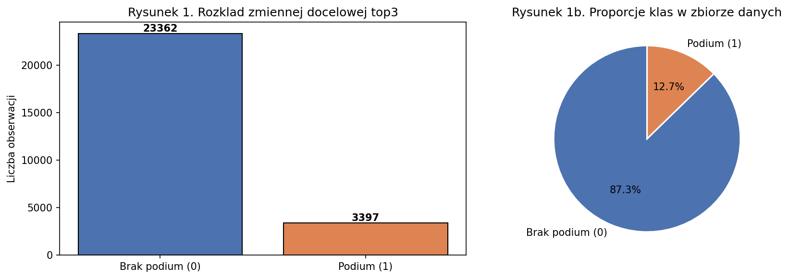
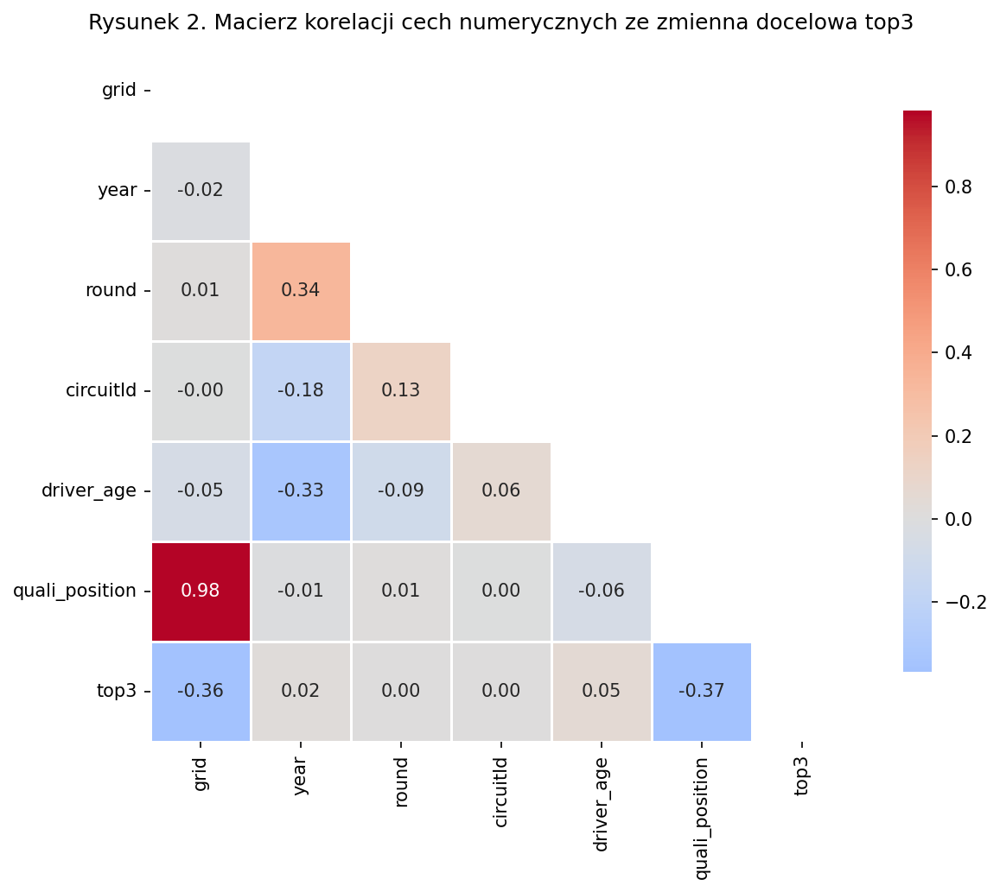
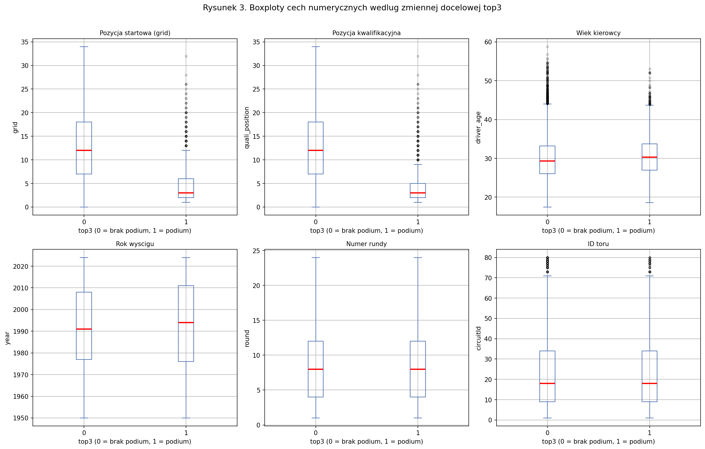
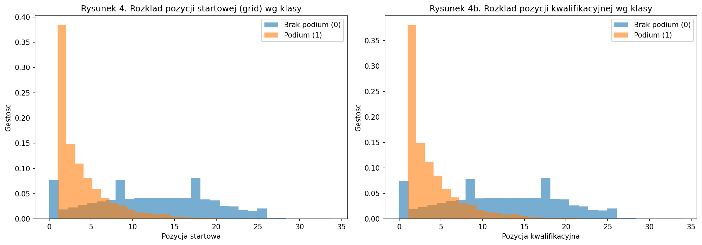
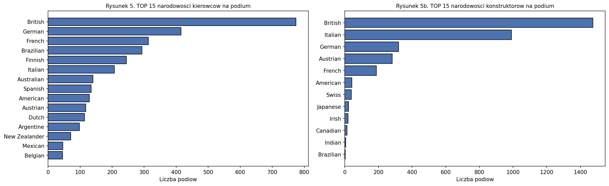

# Eksploracyjna Analiza Danych (EDA)
## Predykcja podium (TOP 3) w wyścigach Formuły 1

## 1. Charakterystyka zbioru danych i asymetria klas

Analizowany zbiór danych pochodzi z historycznych rekordów wyścigów Formuły 1 (źródło: Kaggle) i liczy **26 759 obserwacji**, z których każda opisuje jeden start kierowcy w wyścigu. Zmienną docelową jest binarna kolumna `top3`, przyjmująca wartość 1 dla ukończenia wyścigu na podium (miejsce 1–3) oraz 0 w pozostałych przypadkach.

**Tabela 1. Rozkład zmiennej docelowej `top3`**

| Klasa | Liczba obserwacji | Udział |
| :--- | :---: | :---: |
| **0 – Brak podium** | 23 362 | 87,30% |
| **1 – Podium** | 3 397 | 12,70% |

Zbiór wykazuje wyraźną **asymetrię klas** — stosunek klasy negatywnej do pozytywnej wynosi około 6,9:1. Jest to zjawisko typowe dla problemów predykcji rzadkich zdarzeń sportowych, gdzie tylko trzech z dwudziestu zawodników może znaleźć się na podium w każdym wyścigu. Silna nierównowaga klas stanowi kluczowe wyzwanie metodologiczne i bezpośrednią przesłankę do stosowania ważenia klas (`class_weight='balanced'`) oraz oceny modeli za pomocą metryk odpornych na dominację klasy większościowej (AUC, Czułość, F1-score).

*Rysunek 1. Rozkład zmiennej docelowej top3 oraz proporcje klas w zbiorze danych.*

## 2. Statystyki opisowe cech numerycznych

Do analizy i modelowania wyselekcjonowano sześć cech numerycznych: `grid` (pozycja startowa), `quali_position` (pozycja w kwalifikacjach), `driver_age` (wiek kierowcy w dniu wyścigu), `year` (rok sezonu), `round` (numer rundy w sezonie) oraz `circuitId` (identyfikator toru). Zmienne te stanowią rdzeń zbioru predyktorów, odzwierciedlając zarówno bezpośrednią formę sportową kierowcy, jak i kontekst historyczny i geograficzny wyścigu.

Statystyki opisowe ujawniają istotne cechy strukturalne zbioru. Zmienna `grid` przyjmuje wartości od 0 do 34 (mediana ~11), przy czym wartości zerowe odpowiadają startom z alei serwisowej (pit lane). Zmienna `quali_position` wykazuje analogiczny rozkład. Zmienna `driver_age` oscyluje wokół 29–30 lat, co odzwierciedla typowy wiek kierowcy F1 w szczytowej formie. Zakres `year` obejmuje kilkadziesiąt sezonów historycznych, co nadaje zbiorowi charakter przekrojowy i wprowadza zmienność technologiczną oraz regulaminową.

## 3. Macierz korelacji cech numerycznych

Analizę zależności liniowych przeprowadzono dla sześciu predyktorów numerycznych oraz zmiennej docelowej. Wyniki macierzy korelacji Pearsona prezentuje poniższy rysunek:

*Rysunek 2. Macierz korelacji cech numerycznych ze zmienną docelową top3.*

Najistotniejsze obserwacje płynące z analizy macierzy korelacji:

**Korelacja z `top3`:** Najsilniejszą ujemną korelację ze zmienną docelową wykazują `quali_position` (r ≈ −0.35) oraz `grid` (r ≈ −0.33). Ujemny kierunek jest naturalny — niższa wartość pozycji (bliżej 1) odpowiada lepszemu miejscu na starcie i wyższemu prawdopodobieństwu podium. Pozostałe zmienne (`year`, `round`, `circuitId`, `driver_age`) wykazują słabą korelację liniową z `top3` (|r| < 0.1), co nie wyklucza ich istotności w nieliniowych modelach drzewiastych.

**Współliniowość predyktorów:** Korelacja między `quali_position` a `grid` wynosi około 0.80, co wskazuje na silne współliniowość — wynik kwalifikacji jest niemal bezpośrednim determinantem pozycji startowej. Dla modeli drzewiastych, które są odporne na wielowspółliniowość, nie stanowi to problemu metodologicznego, jednak warto mieć na uwadze, że obie zmienne niosą zbliżoną informację o formie zawodnika.

## 4. Boxploty cech numerycznych względem zmiennej docelowej

W celu porównania rozkładów wartości predyktorów dla obu klas docelowych wygenerowano wykresy pudełkowe:

*Rysunek 3. Boxploty cech numerycznych według zmiennej docelowej top3.*

Analiza wykresów pudełkowych pozwala na kilka kluczowych obserwacji:

**`grid` i `quali_position`:** Obie zmienne wykazują wyraźną separowalność między klasami. Dla obserwacji klasy 1 (podium) mediana `grid` wynosi około 2–3, natomiast dla klasy 0 skupia się w przedziale 10–15. Pudełka obu klas nie zachodzą na siebie w obszarze mediany, co potwierdza, że pozycja startowa jest najsilniejszym predyktorem podium w F1.

**`driver_age`:** Rozkłady wiekowe dla obu klas są zbliżone, choć kierowcy na podium wykazują nieznacznie niższą medianą wieku (~28 vs ~30 lat). Może to odzwierciedlać fakt, że czołowe miejsca w stawce są obsadzane przez zawodników w pełni sezonu kariery.

**`year`, `round`, `circuitId`:** Zmienne te nie wykazują wyraźnej separowalności między klasami w ujęciu liniowym. Ich rozkłady pudełkowe dla klas 0 i 1 są praktycznie identyczne, co potwierdza wcześniejsze obserwacje z macierzy korelacji. Nie wyklucza to jednak ich roli w złożonych, nieliniowych interakcjach wykrywanych przez modele drzewiste.

## 5. Rozkłady kluczowych predyktorów według klas

Histogramy gęstości dla `grid` i `quali_position` z podziałem na klasy docelowe ujawniają mechanizm separowalności:

*Rysunek 4. Rozkład pozycji startowej i kwalifikacyjnej według klasy docelowej.*

Rozkład klasy 1 (podium) dla obu zmiennych jest silnie skośny prawostronnie i skoncentrowany w wartościach 1–3. Klasa 0 (brak podium) prezentuje rozkład znacznie bardziej jednorodny, rozłożony na całą szerokość stawki startowej (1–34). Tak wyraźna asymetria rozkładów uzasadnia dominującą rolę `grid` i `quali_position` jako głównych predyktorów modelu drzewiastego i jest spójna z regułami odkrytymi przez algorytm CART w procesie budowy drzewa.

## 6. Analiza cech kategorycznych — narodowości na podium

Zbiór zawiera dwie cechy kategoryczne: `driver_nationality` (narodowość kierowcy) oraz `constructor_nationality` (narodowość konstruktora). Analiza ich rozkładów w kontekście klasy pozytywnej pozwala zidentyfikować dominujące narodowości historycznie powiązane z sukcesem w F1:

*Rysunek 5. TOP 15 narodowości kierowców i konstruktorów według liczby podiów.*

Wśród kierowców dominują narodowości z krajów o silnych tradycjach motoryzacyjnych: Brytyjczycy, Niemcy, Brazylijczycy i Finowie. Po stronie konstruktorów wyróżniają się Brytyjczycy i Włosi, co odzwierciedla historyczną dominację zespołów zarejestrowanych w Wielkiej Brytanii (Ferrari jest włoskim wyjątkiem). Względnie niewielka ważność tych cech w modelach predykcyjnych wynika z faktu, że narodowość jest jedynie pośrednim wskaźnikiem jakości — w rzeczywistości model wykrywa wzorzec, że pewne narodowości historycznie częściej startowały z pierwszych rzędów stawki.

## 7. Wnioski z analizy eksploracyjnej

Przeprowadzona analiza EDA dostarcza następujących wniosków, które bezpośrednio kształtują decyzje metodologiczne w etapie modelowania:

1. **Asymetria klas (87%/13%)** wymaga stosowania metryk odpornych na dominację klasy 0 oraz technik kompensujących nierównowagę (ważenie klas, odpowiedni wybór progu decyzyjnego).
2. **`quali_position` i `grid`** są zdecydowanie najsilniejszymi predyktorami podium — wykazują największą separowalność między klasami i najwyższe korelacje z `top3`. Stanowią korzeń optymalnego drzewa decyzyjnego.
3. **Zmienne kontekstowe** (`year`, `round`, `circuitId`) mają słabą korelację liniową z `top3`, lecz mogą uczestniczyć w złożonych nieliniowych interakcjach modelowanych przez algorytmy drzewiaste (np. `year <= 1990.50` jako próg historycznej zmiany niezawodności bolidów).
4. **Wysoka współliniowość** `grid` i `quali_position` jest znana i akceptowana — dla modeli drzewiastych nie stanowi problemu metodologicznego.
5. **Cechy kategoryczne** (narodowości) mają ograniczone znaczenie predykcyjne jako cechy samodzielne, lecz ich kodowanie One-Hot (72 predyktory łącznie) dostarcza modelowi drobnych, statystycznie mierzalnych sygnałów.
