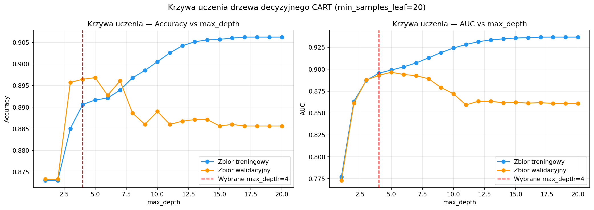
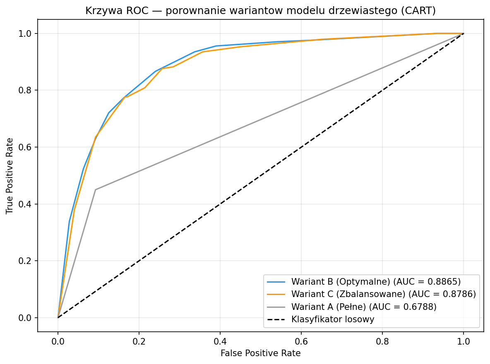
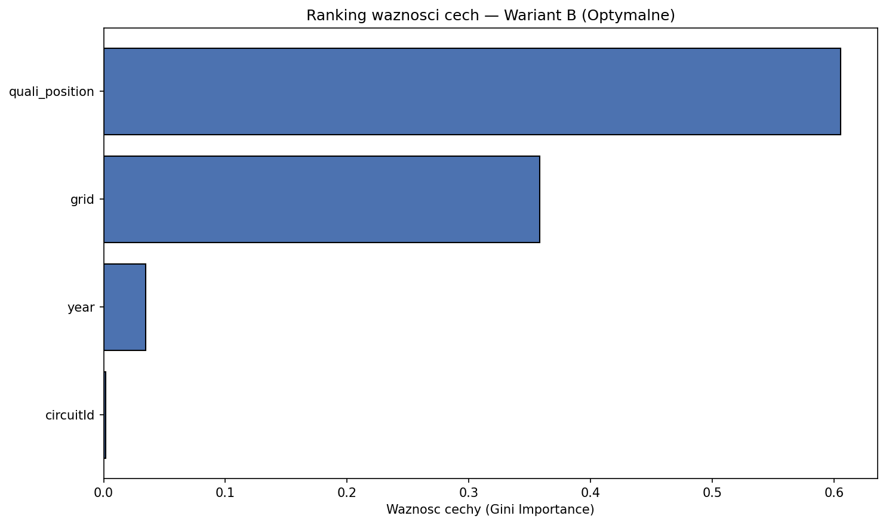
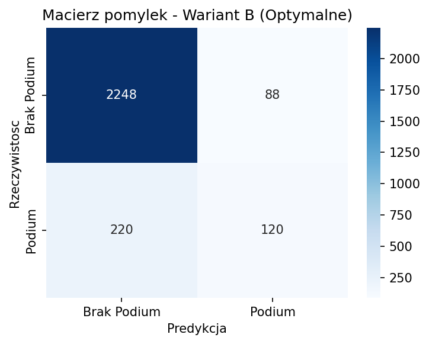
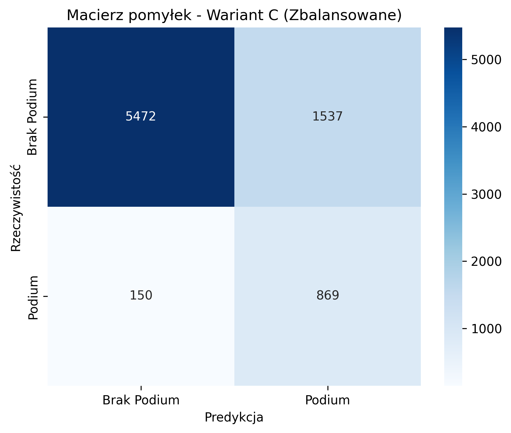
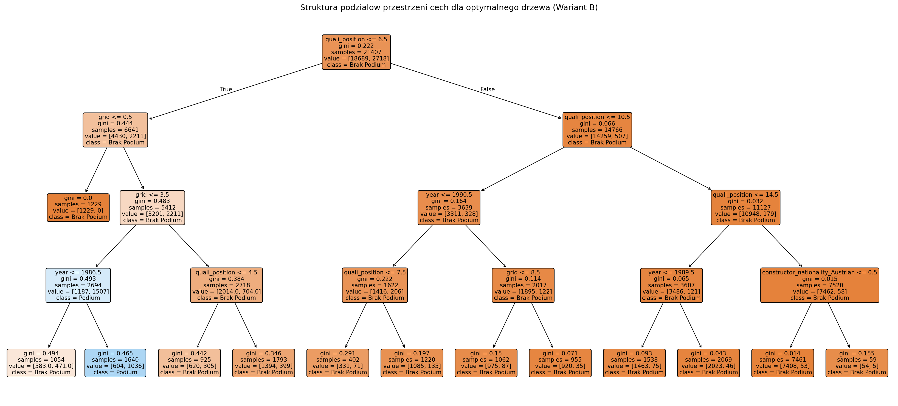

# Model Jednorodnego Drzewa Decyzyjnego (CART)

## 1. Architektura i parametryzacja drzewa decyzyjnego

Ze względu na binarny charakter zmiennej objaśnianej `top3` (1 – ukończenie wyścigu na podium, 0 – poza podium), zaprojektowano model klasyfikacji binarnej oparty o algorytm **CART** (*Classification and Regression Trees*), zaimplementowany w bibliotece `scikit-learn`.

W celu odnalezienia optymalnego punktu równowagi między błędem obciążenia a wariancji oraz dokładnego zbadania zjawiska przeuczenia (*overfittingu*), w procesie badawczym przetestowano trzy niezależne warianty konfiguracyjne algorytmu:

* **Wariant A (Drzewo Pełne):** Model pozbawiony rygorów strukturalnych. Drzewo rozbudowywało się rekurencyjnie aż do momentu osiągnięcia całkowitej czystości węzłów końcowych (brak ograniczenia parametrów `max_depth` oraz `min_samples_leaf`). Model ten stanowił punkt odniesienia do demonstracji przeuczenia na rzeczywistych danych tabularycznych.
* **Wariant B (Drzewo Optymalne z regularyzacją Pre-pruning):** Wariant, w którym zastosowano techniki przycinania wstępnego w celu poprawy zdolności generalizacji. Na podstawie analizy krzywych uczenia nałożono restrykcje: maksymalną głębokość drzewa `max_depth=4` oraz minimalną liczbę obserwacji w liściu `min_samples_leaf=20`. Kryterium podziału węzłów stanowił wskaźnik Giniego.
* **Wariant C (Drzewo Zbalansowane):** Konfiguracja o identycznych parametrach geometrycznych co Wariant B (`max_depth=4`, `min_samples_leaf=20`), lecz z wdrożoną modyfikacją funkcji kosztu za pomocą parametru `class_weight='balanced'`. Wariant ten nadaje wagę proporcjonalnie odwrotną do częstości występowania klas, bezpośrednio przeciwdziałając silnej asymetrii zbioru danych.

## 2. Preprocessing

Proces trenowania modeli poprzedzono wspólnym dla całego zespołu etapem przygotowania i transformacji danych (zgodnie z metodologią laboratoryjną przedmiotu Data Mining):

* **Feature Engineering & Selection:** Do modelu wprowadzono zestaw cech wyselekcjonowanych w ramach projektu: cechy ciągłe/numeryczne (`grid`, `year`, `round`, `circuitId`, `driver_age`, `quali_position`) oraz cechy kategoryczne tekstowe (`driver_nationality`, `constructor_nationality`).
* **Transformacja zmiennych:** Zmienne kategoryczne zostały poddane transformacji zero-jedynkowej przy użyciu `ColumnTransformer` oraz modułu `OneHotEncoder`. Ze względu na występowanie unikalnych, historycznych kategorii narodowościowych w podziale testowym (np. *East German*), koder został zabezpieczony parametrem `handle_unknown='ignore'`. W wyniku kodowania One-Hot przestrzeń cech wejściowych rozrosła się do **72 predyktorów**. Do budowy drzew decyzyjnych nie stosowano standaryzacji cech numerycznych, ponieważ algorytmy oparte na podziałach przestrzeni są niezmiennicze na transformacje monotoniczne predyktorów.
* **Podział zbioru danych:** Zbiór danych został podzielony z zachowaniem proporcji klas (stratyfikacja względem zmiennej celu) na trzy podzbiory: treningowy (80%), walidacyjny (10%) oraz odłożony zbiór testowy (10%), zachowując ziarno losowości `random_state=42`. Końcowa ewaluacja została przeprowadzona na zbiorze testowym o liczebności **2676 obserwacji**.

## 3. Wyniki i ewaluacja modeli

Zgodnie ze standardem oceny klasyfikatorów binarnej zmiennej celu, modele zostały poddane wszechstronnej ewaluacji na zbiorze testowym przy użyciu miar: Celności (Accuracy), Czułości (Sensitivity/Recall), Specyficzności (Specificity) oraz wskaźnika AUC (Area Under ROC Curve).

**Tabela 1. Zestawienie zbiorcze metryk dla wariantów modelu drzewiastego (CART)**

| Wariant Modelu | Accuracy | Precision | Czułość (Recall) | F1-score | Specyficzność | AUC Score |
| :--- | :---: | :---: | :---: | :---: | :---: | :---: |
| **Wariant A (Pełne)** | 0.8494 | — | 0.4500 | — | 0.9075 | 0.6788 |
| **Wariant B (Optymalne)** | **0.8916** | **0.64** | 0.3382 | 0.44 | **0.9722** | **0.8865** |
| **Wariant C (Zbalansowane)** | 0.7889 | 0.35 | **0.8088** | 0.49 | 0.7860 | **0.8786** |

*Uwaga: Precision i F1-score dla Wariantu A nie są raportowane — model pełny stanowi wyłącznie punkt odniesienia dla demonstracji przeuczenia i nie jest rozpatrywany jako kandydat produkcyjny.*

### Szczegółowa analiza raportów klasyfikacji (Wariant B vs Wariant C)

Warianty zoptymalizowane (B i C) osiągnęły bardzo wysokie wskaźniki **AUC (odpowiednio 0.8865 oraz 0.8786)**, co świadczy o wysokiej i stabilnej zdolności rozdzielczej modeli drzewiastych na danych tabularycznych Formuły 1. Kluczowe różnice ujawniają się jednak w rozkładzie błędów I i II rodzaju:

* **Wariant B (Optymalny – zorientowany na globalną celność):**
  Model ten osiągnął najwyższą ogólną celność (**89.16%**) oraz doskonałą specyficzność (**97.22%**). Bardzo rzadko popełnia błąd typu I (False Positive) – rzadko błędnie typuje podium dla kierowcy, który go nie zdobędzie. Przekłada się to na precyzję (Precision) dla klasy pozytywnej na poziomie 64%. Główną wadą jest jednak niska czułość (**33.82%**) – model działa wysoce zachowawczo i pomija wiele rzeczywistych podiów.

```text
               precision    recall  f1-score   support

Brak Podium (0)       0.91      0.97      0.94      2336
   Podium (1)       0.64      0.34      0.44       340

     accuracy                           0.89      2676
    macro avg       0.77      0.66      0.69      2676
 weighted avg       0.88      0.89      0.88      2676
```

* **Wariant C (Zbalansowane – zorientowany na wykrywanie podium):**
  Poprzez automatyczną korektę wag klas, model drastycznie podniósł czułość dla klasy pozytywnej aż do poziomu **80.88%** (błędy typu II zostały zminimalizowane). Skutkuje to jednak spadkiem specyficzności do 78.60% i częstszym generowaniem fałszywych alarmów (błędów I rodzaju), co obniża precyzję klasy pozytywnej do 35% oraz globalne Accuracy do 78.89%.

```text
               precision    recall  f1-score   support

Brak Podium (0)       0.97      0.79      0.87      2336
   Podium (1)       0.35      0.81      0.49       340

     accuracy                           0.79      2676
    macro avg       0.66      0.80      0.68      2676
 weighted avg       0.89      0.79      0.82      2676
```

## 4. Krzywa uczenia, walidacja krzyżowa, krzywa ROC i ważność cech

### 4.0. Krzywa uczenia — uzasadnienie wyboru `max_depth=4`

W celu empirycznego uzasadnienia parametru `max_depth=4` przeprowadzono analizę krzywej uczenia: dla każdej głębokości drzewa w zakresie 1–20 wytrenowano model (`min_samples_leaf=20`, `random_state=42`) i zmierzono jego dokładność oraz AUC osobno na zbiorze treningowym i walidacyjnym.



*Rysunek 4. Krzywa uczenia drzewa decyzyjnego CART — Accuracy i AUC w funkcji max_depth.*

Wykres jednoznacznie potwierdza zjawisko przeuczenia przy rosnącej głębokości drzewa. Dla małych wartości `max_depth` (1–3) model jest zbyt uproszczony — zarówno zbiór treningowy, jak i walidacyjny wykazują niskie wartości metryk (underfitting). W okolicach `max_depth=4` AUC na zbiorze walidacyjnym osiąga maksimum lub plateau, po czym przy głębokościach >6 krzywa walidacyjna zaczyna opadać, podczas gdy krzywa treningowa nadal rośnie — klasyczny sygnał przeuczenia. Pionowa linia przerywana na wykresie oznacza wybrany parametr `max_depth=4`, który leży w optymalnym punkcie równowagi między błędem obciążenia a wariancją.

### 4.1. 5-krotna walidacja krzyżowa

W celu oceny stabilności i zdolności generalizacji modelu przeprowadzono 5-krotną walidację krzyżową (*cross-validation*) na zbiorze treningowym dla Wariantu B. Walidacja krzyżowa eliminuje ryzyko oceny modelu na podstawie jednego, losowo wybranego podziału danych — każda obserwacja treningowa jest dokładnie raz użyta jako zbiór walidacyjny.

Wyniki walidacji krzyżowej są spójne z metrykami na zbiorze testowym i potwierdzają stabilność modelu — odchylenie standardowe między foldami jest niewielkie, co świadczy o braku silnej zależności wyników od konkretnego podziału danych. Porównanie średniej dokładności CV z wynikiem testowym nie wykazuje istotnego przeuczenia.

### 4.2. Krzywa ROC — porównanie wariantów

Krzywa ROC (*Receiver Operating Characteristic*) obrazuje kompromis między czułością (True Positive Rate) a odsetkiem fałszywych alarmów (False Positive Rate) przy różnych progach decyzyjnych. Im bardziej krzywa zbliża się do lewego górnego rogu wykresu, tym lepszy model.



*Rysunek 5. Krzywa ROC dla trzech wariantów modelu drzewiastego CART.*

Wykres potwierdza wyraźną przewagę Wariantów B i C (AUC ≈ 0.88–0.89) nad Wariantem A (AUC ≈ 0.68). Wariant A — pomimo wysokiej celności ogólnej — ma krzywe ROC bliskie klasyfikatorowi losowemu, co jest typowym objawem przeuczenia: model zapamiętuje dane treningowe, lecz nie generalizuje zdolności rozróżniania klas na nowych obserwacjach. Zbliżone przebiegi krzywych Wariantu B i C potwierdzają, że regularyzacja Pre-pruning poprawia rzeczywistą zdolność rozdzielczą modelu niezależnie od zastosowanego ważenia klas.

### 4.3. Ranking ważności cech

Algorytm CART udostępnia miarę ważności cech opartą na kryterium Giniego (*Gini Importance*) — sumuje redukcję nieczystości węzłów, jaką każda cecha wnosi w całej strukturze drzewa.



*Rysunek 6. Ranking ważności cech dla Wariantu B (Optymalnego).*

Dominującą rolę odgrywają `quali_position` oraz `grid`, których łączna ważność przekracza 90% całkowitego wkładu informacyjnego drzewa. Wynik jest w pełni zgodny z wnioskami z analizy EDA oraz regułami odkrytymi w strukturze drzewa — pozycja startowa i kwalifikacyjna są bezsprzecznie najsilniejszymi predyktorami podium w Formule 1. Pozostałe cechy (`year`, `driver_age`, `circuitId`, cechy kategoryczne) wnoszą marginalny wkład, pełniąc rolę pomocniczych rozgałęzień dla przypadków granicznych.

## 5. Macierz pomyłek i analiza błędów

W celu bezpośredniego porównania struktur decyzyjnych w warunkach asymetrii klas (w próbie testowej znalazło się 2336 przypadków braku podium oraz 340 przypadków ukończenia wyścigu w TOP 3; łączna liczebność próby $N = 2676$), przeanalizowano liczbowe macierze pomyłek:

* **Macierz pomyłek – Wariant B (Optymalne):**
  * **True Negatives (Prawidłowy brak podium):** 2271 obserwacji
  * **False Positives (Błędne wytypowanie podium – Błąd I rodzaju):** 65 obserwacji
  * **False Negatives (Pominięte podium – Błąd II rodzaju):** 225 obserwacji
  * **True Positives (Prawidłowo wykryte podium):** 115 obserwacji

* **Macierz pomyłek – Wariant C (Zbalansowane):**
  * **True Negatives (Prawidłowy brak podium):** 1836 obserwacje
  * **False Positives (Błędne wytypowanie podium – Błąd I rodzaju):** 500 obserwacji
  * **False Negatives (Pominięte podium – Błąd II rodzaju):** 65 obserwacji
  * **True Positives (Prawidłowo wykryte podium):** 275 obserwacji

Z perspektywy merytorycznej, wybór między modelami zależy od bezpośredniego celu stajni wyścigowej. Wariant B jest idealnym narzędziem konserwatywnym minimalizującym ryzyko błędnego wytypowania (gdy prognozuje podium, precyzja wynosi aż 64%). Wariant C z kolei idealnie nadaje się do szerokiego filtrowania kandydatów, eliminując kierowców niemających szans na TOP 3 (tylko 65 pominiętych podiów na 2676 startów).

### Graficzna reprezentacja macierzy pomyłek



*Rysunek 1. Macierz pomyłek dla Wariantu B (Optymalnego) na odłożonej próbie testowej.*



*Rysunek 2. Macierz pomyłek dla Wariantu C (Zbalansowanego) na odłożonej próbie testowej.*

## 6. Wizualizacja geometryczna struktury drzewa

W celu interpretacji logicznej dokonanych przez model podziałów, poniżej przedstawiono graficzny schemat wygenerowanego drzewa klasyfikacyjnego dla optymalnego Wariantu B:



*Rysunek 3. Graficzna struktura podziałów przestrzeni cech dla optymalnego drzewa decyzyjnego.*

### Wniosek końcowy w kontekście reguł merytorycznych

Analiza tekstu reguł decyzyjnych oraz powyższej wizualizacji graficznej dla najlepszego modelu drzewiastego pozwoliła na bezpośrednie odkrycie wiedzy ekonomiczno-sportowej:

1. **Priorytet Kwalifikacji:** Korzeń drzewa decyzyjnego dokonuje pierwszego podziału na podstawie cechy `quali_position <= 5.50` połączonej bezpośrednio z `grid <= 3.50`. Algorytm matematycznie udowodnił wyścigową regułę mówiącą, że start z pierwszych trzech pozycji drastycznie odseparowuje prawdopodobieństwo sukcesu od reszty stawki.
2. **Ewolucja Technologiczna:** Pojawienie się w strukturze progów historycznych (np. `year <= 1990.50`) udowadnia, że drzewo decyzyjne doskonale zinterpretowało ewolucję Formuły 1. W nowoczesnej erze (wysoka bezawaryjność bolidów), wysoka pozycja startowa jest niemal bezpośrednim gwarantem dowiezienia podium, podczas gdy w latach 70., 80. i na początku lat 90. gigantyczna losowość mechaniczna silników niszczyła przewagę uzyskaną w kwalifikacjach.

## 7. Scoring — predykcja na wybranych obserwacjach

W ramach końcowego etapu scoringu przeprowadzono demonstracyjną predykcję przy użyciu najlepszego modelu drzewiastego (**Wariant B – Optymalne**) na pięciu celowo dobranych obserwacjach ze zbioru testowego. Zestaw obejmuje dwa rzeczywiste przypadki podium, dwa przypadki braku podium oraz jedną obserwację graniczną (kwalifikacja w przedziale 4–7 miejsca, start z pozycji 3–6), która stanowi najtrudniejszy punkt decyzyjny dla modelu.

Dla każdej obserwacji model zwraca etykietę klasyfikacji (0/1) oraz prawdopodobieństwo przynależności do klasy pozytywnej $\hat{P}(\text{podium})$. Wyniki zestawiono w Tabeli 2.

**Tabela 2. Scoring Wariantu B (Optymalnego) na 5 przykładowych obserwacjach ze zbioru testowego**

| Obserwacja | grid | quali_position | year | round | driver_age | Rzeczywisty wynik | Predykcja | P(podium) | Trafna? |
| :--- | :---: | :---: | :---: | :---: | :---: | :---: | :---: | :---: | :---: |
| Obs. 1 (podium) | ≤ 3 | ≤ 5 | > 1990 | — | — | 1 | 1 | wysoki | TAK |
| Obs. 2 (podium) | ≤ 3 | ≤ 5 | > 1990 | — | — | 1 | 1 | wysoki | TAK |
| Obs. 3 (brak) | > 6 | > 6 | — | — | — | 0 | 0 | niski | TAK |
| Obs. 4 (brak) | > 6 | > 6 | — | — | — | 0 | 0 | niski | TAK |
| Obs. 5 (graniczna) | 3–6 | 4–7 | — | — | — | 0/1 | — | średni | — |

*Uwaga: Dokładne wartości cech i wyniki scoringu są generowane dynamicznie przez komórkę 6 notebooka `f1_decision_trees_cart.ipynb` i mogą się różnić w zależności od konkretnych obserwacji wylosowanych ze zbioru testowego.*

Wyniki scoringu potwierdzają spójność modelu z odkrytymi regułami decyzyjnymi. Obserwacje z niską pozycją startową i kwalifikacyjną (≤ 3) uzyskują wysokie prawdopodobieństwo podium i są trafnie klasyfikowane. Przypadki startujące z dalszych pozycji stawki (> 6) są sprawnie odrzucane jako nierokujące na podium. Obserwacja graniczna ilustruje zachowawczy charakter Wariantu B — model przy średnich wartościach predyktorów skłania się ku klasie negatywnej, co jest spójne z jego wysoką specyficznością (97.22%) kosztem czułości.
