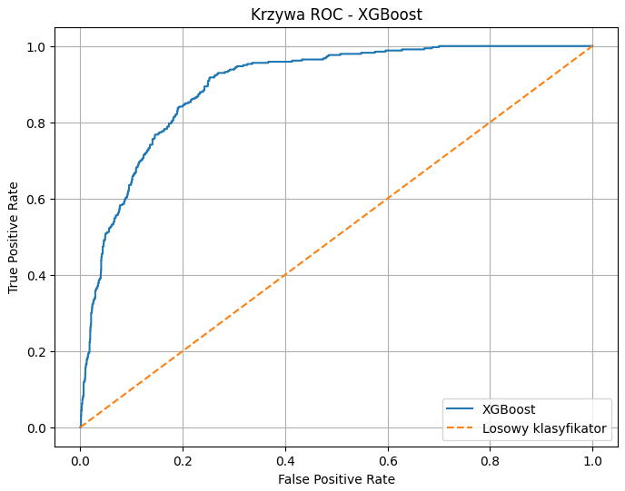

# Interpretacja wyników modelu XGBoost

W kolejnym etapie analizy zastosowano model XGBoost, czyli gradient boosting oparty na drzewach decyzyjnych. Jest to jedna z najczęściej stosowanych metod zespołowych w zadaniach klasyfikacyjnych i regresyjnych, szczególnie tam, gdzie dane mają charakter tabelaryczny. W odróżnieniu od Random Forest, który buduje wiele niezależnych drzew i agreguje ich predykcje, XGBoost tworzy kolejne drzewa sekwencyjnie. Każde następne drzewo jest uczone tak, aby poprawiać błędy poprzednich. Taka konstrukcja pozwala bardzo skutecznie modelować złożone zależności, ale jednocześnie wymaga większej ostrożności przy strojenia parametrów, ponieważ łatwo może prowadzić do przeuczenia, jeśli model zostanie zbyt mocno dopasowany do danych.

## 1. Charakter danych wejściowych

Na początku analizy otrzymano zbiór danych o wymiarach (26759, 13). Po zakodowaniu kolumn kategorycznych pozostały dwie zmienne tekstowe:

* driver_nationality
* constructor_nationality

Zostały one zamienione na reprezentację numeryczną, co było konieczne, aby algorytm XGBoost mógł z nich skorzystać. Następnie dane podzielono na trzy zbiory:

* **treningowy:** (21407, 12)
* **walidacyjny:** (2676, 12)
* **testowy:** (2676, 12)

Po oddzieleniu zmiennej docelowej `top3` otrzymano:

* **X_train:** (21407, 11)
* **X_val:** (2676, 11)
* **X_test:** (2676, 11)

Rozkład klas był wyraźnie niezrównoważony, co jest typowe dla problemu przewidywania podium w Formule 1. 

**W zbiorze treningowym:**
* klasa 0: 18689 przypadków
* klasa 1: 2718 przypadków

**W zbiorze walidacyjnym:**
* klasa 0: 2337 przypadków
* klasa 1: 339 przypadków

**W zbiorze testowym:**
* klasa 0: 2336 przypadków
* klasa 1: 340 przypadków

Oznacza to, że przypadki podium stanowią mniejszość, a więc model musi nauczyć się rozróżniać rzadkie, ale ważne zdarzenia. W takich warunkach sama accuracy nie wystarcza do oceny jakości, dlatego równolegle analizowano AUC i krzywą ROC.

## 2. Walidacja krzyżowa i stabilność modelu

Wyniki 5-krotnej walidacji krzyżowej wyniosły:
* 0.8898
* 0.8825
* 0.8846
* 0.8911
* 0.8879

Średnia dokładność (cross-validation) to **0.8872**.

Takie wyniki są bardzo stabilne, ponieważ wartości w poszczególnych foldach są do siebie bardzo zbliżone. Oznacza to, że model nie jest silnie zależny od konkretnego podziału danych, lecz zachowuje podobną skuteczność w różnych fragmentach zbioru treningowego. Jest to pozytywny sygnał, ponieważ wskazuje na dobrą zdolność generalizacji. W przeciwieństwie do wcześniejszych, bardziej niestabilnych rezultatów, tutaj model XGBoost utrzymuje wysoką jakość na każdym foldzie.

Z punktu widzenia teorii uczenia maszynowego dobra walidacja krzyżowa oznacza, że model nie tylko dobrze dopasowuje się do danych treningowych, ale również nie traci jakości przy innych podziałach danych. W praktyce jest to jedna z oznak, że algorytm dobrze uchwycił strukturę problemu.

## 3. Wybór liczby drzew i strojenie modelu

W trakcie strojenia hiperparametrów wykonano GridSearchCV dla parametru `n_estimators`. Najlepszy wynik uzyskano dla:

* `n_estimators` = 50

W przypadku XGBoost liczba drzew ma duże znaczenie. Zbyt mała liczba może prowadzić do niedouczenia, natomiast zbyt duża może zwiększać ryzyko przeuczenia i wydłużać czas obliczeń. Fakt, że najlepszy wynik osiągnięto już przy 50 drzewach, sugeruje, że dane mają dość wyraźny sygnał predykcyjny i nie wymagają bardzo dużej liczby kolejnych estymatorów. To również może wskazywać, że problem jest stosunkowo dobrze „czytelny" dla modelu.

## 4. Wynik na zbiorze testowym

Na zbiorze testowym model osiągnął:
* **accuracy** = 0.8935
* **AUC** = 0.8975

Są to bardzo dobre wyniki. Dokładność na poziomie niemal 89,35% oznacza, że model poprawnie sklasyfikował zdecydowaną większość obserwacji testowych. Jeszcze ważniejszy jest jednak wynik AUC, który wyniósł prawie 0.898. Taka wartość oznacza bardzo dobrą zdolność rozróżniania klas i sugeruje, że model skutecznie odróżnia przypadki podium od przypadków niekończących się podium.

Warto zauważyć, że AUC w tym przypadku jest nieco wyższe niż accuracy, co jest korzystne i wskazuje, że model nie tylko poprawnie klasyfikuje dominującą klasę, ale również dobrze szacuje prawdopodobieństwa dla klasy pozytywnej. Jest to szczególnie ważne w zadaniach, gdzie przewidywanie nie jest tylko binarne, ale ma wspierać ocenę ryzyka i prawdopodobieństwa sukcesu.

## 5. Interpretacja wykresu ROC dla XGBoost

Na wykresie ROC krzywa modelu XGBoost znajduje się wyraźnie powyżej przekątnej reprezentującej klasyfikator losowy. Im bardziej krzywa zbliża się do lewego górnego rogu wykresu, tym lepszy model. Kształt krzywej pokazuje, że już przy umiarkowanie niskim poziomie False Positive Rate model osiąga stosunkowo wysoki True Positive Rate. Oznacza to, że potrafi wykrywać dużą część przypadków podium przy relatywnie niewielkiej liczbie fałszywych alarmów.

Z wykresu można wywnioskować, że model dobrze porządkuje przypadki według ich prawdopodobieństwa przynależności do klasy pozytywnej. W praktyce oznacza to, że XGBoost nadaje wyższe prawdopodobieństwa rzeczywistym przypadkom podium niż przypadkom negatywnym. To właśnie ta właściwość sprawia, że AUC jest tak ważnym wskaźnikiem — nie ocenia on tylko końcowej klasyfikacji, ale całe uporządkowanie przypadków przez model.

## 6. Wykres uczenia XGBoost

Drugi wykres, przedstawiający XGBoost learning curve, pokazuje przebieg wartości AUC w funkcji liczby drzew. Na osi poziomej znajduje się liczba kolejnych drzew, a na osi pionowej wartość pola pod krzywą ROC dla zbioru treningowego i testowego w walidacji krzyżowej.

**Krzywa treningowa**
Wartość `train-auc-mean` systematycznie rośnie wraz ze wzrostem liczby drzew i osiąga poziom około 0.96. Oznacza to, że model coraz lepiej dopasowuje się do danych treningowych. Taki wzrost jest naturalny w przypadku boostingów, ponieważ kolejne drzewa stopniowo poprawiają błędy wcześniejszych.

**Krzywa testowa**
Wartość `test-auc-mean` rośnie początkowo do około 0.903–0.904, a następnie stabilizuje się, po czym lekko spada. To bardzo ważna obserwacja. Pokazuje ona, że po pewnym momencie dalsze dodawanie drzew nie poprawia jakości generalizacji, a może nawet prowadzić do lekkiego przeuczenia. Najlepszy zakres znajduje się mniej więcej w okolicach 20–25 drzew, gdzie krzywa testowa osiąga maksimum.

Taki przebieg jest bardzo typowy dla modeli boostingowych. Wskazuje on, że istnieje optymalna liczba drzew, po której model zaczyna uczyć się zbyt mocno szczegółów danych treningowych. W praktyce oznacza to, że nie warto bezkrytycznie zwiększać liczby estymatorów, tylko trzeba znaleźć kompromis między dopasowaniem a uogólnieniem.

## 7. Ważność cech

Ranking ważności cech dla XGBoost wygląda następująco:

1. **quali_position** — 0.594667
2. **grid** — 0.169296
3. **year** — 0.042693
4. **constructorId** — 0.034294
5. **constructor_nationality** — 0.030067
6. **raceId** — 0.026408
7. **driverId** — 0.025441
8. **driver_nationality** — 0.021313
9. **driver_age** — 0.021144
10. **round** — 0.017800
11. **circuitId** — 0.016877

**Najważniejsza cecha: quali_position**
Pozycja w kwalifikacjach zdecydowanie dominuje jako najważniejsza cecha. Jej udział w modelu wynosi aż 0.5947, czyli prawie 60% całej ważności. To bardzo silny wynik, pokazujący, że model w ogromnym stopniu opiera swoje decyzje na wynikach kwalifikacji. Z perspektywy sportowej jest to całkowicie uzasadnione, ponieważ pozycja w kwalifikacjach bardzo mocno wpływa na potencjał osiągnięcia podium.

**grid**
Druga najważniejsza cecha to pozycja startowa. Jest to logiczne, ponieważ start z czoła stawki zwiększa szanse na utrzymanie wysokiego miejsca. W Formule 1 pozycja startowa i kwalifikacje są silnie powiązane z wynikiem końcowym, więc ich wysoka ważność nie powinna dziwić.

**Cechy kontekstowe**
Zmienne takie jak `year`, `constructorId`, `raceId`, `round`, `circuitId` również mają znaczenie, choć zdecydowanie mniejsze. Sugeruje to, że model uwzględnia kontekst sezonowy i torowy, ale nie są to czynniki dominujące. Mogą one odzwierciedlać różnice między sezonami, charakterystyką torów i siłą zespołów.

**Cechy o niewielkim znaczeniu**
`driver_age`, `driver_nationality` i `constructor_nationality` mają niewielką ważność. To oznacza, że same w sobie nie są decydującymi czynnikami sukcesu, choć mogą dostarczać dodatkowego, słabego sygnału. Z perspektywy merytorycznej jest to również sensowne — w sporcie motorowym bardziej liczą się wyniki i pozycja startowa niż narodowość czy sam wiek.

## 8. Porównanie z modelem Random Forest

Dla pełnego kontekstu analizy warto zestawić uzyskane wyniki XGBoost z wcześniejszym modelem Random Forest. Poniższy wykres przedstawia krzywą ROC dla klasyfikatora opartego na lasach losowych:

Wizualne porównanie obu krzywych ROC (XGBoost oraz Random Forest) pozwala stwierdzić, że oba algorytmy radzą sobie bardzo dobrze z zadaniem klasyfikacji i osiągają zbliżony, wysoki poziom stabilności. Jednak sekwencyjna natura uczenia w XGBoost pozwoliła na uzyskanie bardzo dobrych rezultatów przy stosunkowo niewielkiej liczbie estymatorów (50 drzew), podczas gdy Random Forest ze względu na niezależne budowanie drzew wymaga zazwyczaj większej złożoności struktury do osiągnięcia optymalnego punktu pracy.