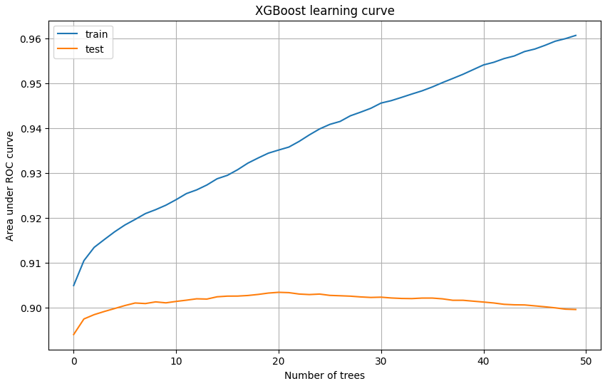
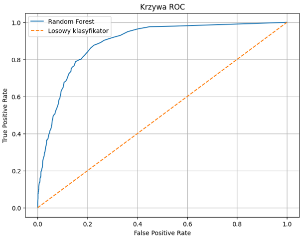

# Interpretacja wyników modelu XGBoost

W kolejnym etapie analizy zastosowano model **XGBoost**, czyli gradient boosting oparty na drzewach decyzyjnych. Jest to jedna z najczęściej stosowanych metod zespołowych w zadaniach klasyfikacyjnych i regresyjnych, szczególnie tam, gdzie dane mają charakter tabelaryczny. 

W odróżnieniu od Random Forest, który buduje wiele niezależnych drzew i agreguje ich predykcje, XGBoost tworzy kolejne drzewa sekwencyjnie. Każde następne drzewo jest uczone tak, aby poprawiać błędy poprzednich. Taka konstrukcja pozwala bardzo skutecznie modelować złożone zależności, ale jednocześnie wymaga większej ostrożności przy strojeniu parametrów — łatwo może prowadzić do przeuczenia, jeśli model zostanie zbyt mocno dopasowany do danych.

---

## 1. Charakter danych wejściowych

Na początku analizy otrzymano zbiór danych o wymiarach (26759, 13). Po zakodowaniu kolumn kategorycznych na reprezentację numeryczną (zmienne tekstowe `driver_nationality` oraz `constructor_nationality`), dane podzielono na trzy zbiory operacyjne. Po oddzieleniu zmiennej docelowej `top3`, ostateczne wymiary prezentują się następująco:

| Zbiór | Wymiary |
| :--- | :--- |
| **Treningowy (X_train)** | (21407, 11) |
| **Walidacyjny (X_val)** | (2676, 11) |
| **Testowy (X_test)** | (2676, 11) |

Rozkład klas w problemie przewidywania podium w Formule 1 jest wyraźnie niezrównoważony. Przypadki podium (Klasa 1) stanowią zdecydowaną mniejszość:

| Zbiór | Klasa 0 (Brak podium) | Klasa 1 (Podium) |
| :--- | :--- | :--- |
| **Treningowy** | 18 689 | 2 718 |
| **Walidacyjny** | 2 337 | 339 |
| **Testowy** | 2 336 | 340 |

W takich warunkach model musi nauczyć się rozróżniać rzadkie, ale ważne zdarzenia. Sama metryka *accuracy* nie wystarcza do oceny jakości, dlatego równolegle analizowano **AUC** i **krzywą ROC**.

---

## 2. Walidacja krzyżowa i stabilność modelu

Wyniki 5-krotnej walidacji krzyżowej (cross-validation) na zbiorze treningowym wyniosły kolejno:

* 0.8898
* 0.8825
* 0.8846
* 0.8911
* 0.8879

> **Średnia dokładność (CV): 0.8872**

Takie wyniki są **bardzo stabilne**, ponieważ wartości w poszczególnych foldach są do siebie bardzo zbliżone. Oznacza to, że model nie jest silnie zależny od konkretnego podziału danych, lecz zachowuje podobną skuteczność w różnych fragmentach zbioru treningowego. Jest to pozytywny sygnał, ponieważ wskazuje na dobrą zdolność generalizacji. W przeciwieństwie do wcześniejszych, bardziej niestabilnych rezultatów, tutaj model XGBoost utrzymuje wysoką jakość na każdym foldzie.

Z punktu widzenia teorii uczenia maszynowego oznacza to, że algorytm dobrze uchwycił strukturę problemu.

---

## 3. Wybór liczby drzew i strojenie modelu

W trakcie strojenia hiperparametrów za pomocą `GridSearchCV` dla parametru `n_estimators`, najlepszy wynik uzyskano dla:

* **`n_estimators` = 50**

W przypadku XGBoost liczba drzew ma kluczowe znaczenie. Zbyt mała liczba może prowadzić do niedouczenia, natomiast zbyt duża może zwiększać ryzyko przeuczenia i wydłużać czas obliczeń. Fakt, że najlepszy wynik osiągnięto już przy 50 drzewach, sugeruje, że dane mają dość wyraźny sygnał predykcyjny i nie wymagają bardzo dużej liczby kolejnych estymatorów. Problem jest stosunkowo dobrze „czytelny" dla modelu.

---

## 4. Wynik na zbiorze testowym

Wyniki końcowe modelu na zbiorze testowym prezentują się następująco:

| Metryka | Wartość |
| :--- | :--- |
| **Accuracy (Dokładność)** | **0.8935** |
| **AUC (Area Under Curve)** | **0.8975** |

Są to bardzo dobre wyniki. Dokładność na poziomie niemal 89,35% oznacza, że model poprawnie sklasyfikował zdecydowaną większość obserwacji testowych. Jeszcze ważniejszy jest jednak wynik AUC, który wyniósł prawie 0.898. Taka wartość oznacza bardzo dobrą zdolność odróżniania przypadków kończących się podium od pozostałych.

Warto zauważyć, że AUC jest w tym przypadku nieco wyższe niż *accuracy*. Dowodzi to, że model nie tylko poprawnie klasyfikuje dominującą klasę, ale również bardzo dobrze szacuje prawdopodobieństwa dla klasy pozytywnej.

---

## 5. Interpretacja wykresu ROC dla XGBoost

Na wykresie ROC krzywa modelu XGBoost znajduje się wyraźnie powyżej przekątnej reprezentującej klasyfikator losowy. Im bardziej krzywa zbliża się do lewego górnego rogu wykresu, tym lepszy model. Kształt krzywej pokazuje, że już przy umiarkowanie niskim poziomie *False Positive Rate* model osiąga stosunkowo wysoki *True Positive Rate*. Oznacza to, że potrafi wykrywać dużą część przypadków podium przy relatywnie niewielkiej liczbie fałszywych alarmów.

Z wykresu można wywnioskować, że model dobrze porządkuje przypadki według ich prawdopodobieństwa przynależności do klasy pozytywnej. W praktyce oznacza to, że XGBoost nadaje wyższe prawdopodobieństwa rzeczywistym przypadkom podium niż przypadkom negatywnym.

---

## 6. Wykres uczenia XGBoost

Drugi wykres, przedstawiający *learning curve*, pokazuje przebieg wartości AUC w funkcji liczby drzew dla zbioru treningowego i testowego w walidacji krzyżowej.

* **Krzywa treningowa (`train-auc-mean`):** Systematycznie rośnie wraz ze wzrostem liczby drzew i osiąga poziom około 0.96. Model coraz lepiej dopasowuje się do danych treningowych, co jest naturalne w przypadku boostingów.
* **Krzywa testowa (`test-auc-mean`):** Rośnie początkowo do około 0.903–0.904, a następnie stabilizuje się, po czym lekko spada. 

To bardzo ważna observation. Pokazuje ona, że po pewnym momencie dalsze dodawanie drzew nie poprawia jakości generalizacji, a może nawet prowadzić do lekkiego przeuczenia. Najlepszy zakres znajduje się mniej więcej w okolicach 20–25 drzew, gdzie krzywa testowa osiąga maksimum. Wskazuje to na optymalny kompromis między dopasowaniem a uogólnieniem.

---

## 7. Ważność cech

Ranking ważności cech (Feature Importance) dla XGBoost wygląda następująco:

| Miejsce | Cecha | Ważność |
| :--- | :--- | :--- |
| **1** | **`quali_position`** | **0.5947** |
| **2** | **`grid`** | **0.1693** |
| 3 | `year` | 0.0427 |
| 4 | `constructorId` | 0.0343 |
| 5 | `constructor_nationality` | 0.0301 |
| 6 | `raceId` | 0.0264 |
| 7 | `driverId` | 0.0254 |
| 8 | `driver_nationality` | 0.0213 |
| 9 | `driver_age` | 0.0211 |
| 10 | `round` | 0.0178 |
| 11 | `circuitId` | 0.0169 |

**Najważniejsza cecha: `quali_position`**
Pozycja w kwalifikacjach zdecydowanie dominuje jako najważniejsza cecha. Jej udział w modelu wynosi aż 0.5947 (prawie 60% całej ważności). Z perspektywy sportowej jest to całkowicie uzasadnione, ponieważ pozycja startowa wywalczona w kwalifikacjach decyduje o potencjale w wyścigu.

**Druga najważniejsza cecha: `grid`**
Pozycja startowa jest drugą dominującą cechą. W Formule 1 kwalifikacje i układ na starcie są silnie powiązane z wynikiem końcowym, co model poprawnie zidentyfikował.

**Cechy kontekstowe i mało istotne**
Zmienne odzwierciedlające kontekst sezonowy i torowy (`year`, `constructorId`, `raceId`) mają mniejsze, ale wciąż zauważalne znaczenie. Z kolei cechy personalne, takie jak `driver_age` czy narodowości (`driver_nationality`, `constructor_nationality`), dostarczają bardzo słabego sygnału. W sporcie motorowym wyniki i forma sprzętu liczą się znacznie bardziej niż pochodzenie czy wiek.

---

## 8. Porównanie z modelem Random Forest

Dla pełnego kontekstu analizy warto zestawić uzyskane wyniki XGBoost z wcześniejszym modelem Random Forest. Poniższy wykres przedstawia krzywą ROC dla klasyfikatora opartego na lasach losowych:

Wizualne porównanie obu krzywych ROC pozwala stwierdzić, że oba algorytmy radzą sobie bardzo dobrze z zadaniem klasyfikacji i osiągają zbliżony, wysoki poziom stabilności. Jednak sekwencyjna natura uczenia w XGBoost pozwoliła na uzyskanie bardzo dobrych rezultatów przy stosunkowo niewielkiej liczbie estymatorów (50 drzew). Z kolei Random Forest, ze względu na niezależne budowanie drzew, wymaga zazwyczaj większej złożoności struktury do osiągnięcia optymalnego punktu pracy.